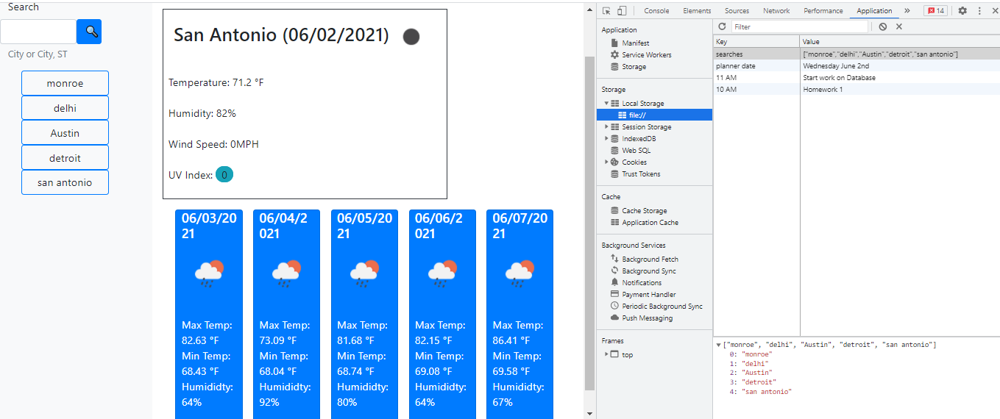
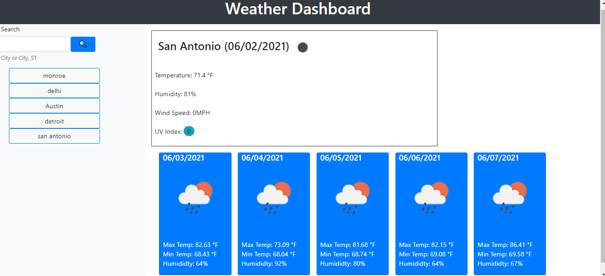

# Weather Dashboard
Making a weather dashboard that displays current weather conditions and a five-day forecast for a given city and any typed in city is saved to a list that when clicked that city weather can be viewed.

 ### Table of Contents
 * [Descritption](#description)
 * [Technologies-Used](#technologies-used)
 * [Installation](#installation)
 * [Usage](#usage)
 * [License](#license)
 * [Contribution](#contribution)
 * [Tests](#tests)
 * [Resources](#resources)
 * [Questions](#questions)
___
  ## Description
  For this project, I designed a fully functional web application that fetches data from the OpenWeatherMap API. When the user searches for a particular city that is listed in the API, current weather conditions for the city appear on the page, along with a five-day forecast for the city.
  The five-day forecast includes the date, the projected weather conditions, an icon reflective of projected weather conditions, projected values for temperature and humidity. By using localstorage the city name would also be saved to a list under the search bar.

  
  

## Technologies-Used
* HTML
* CSS 
* Bootstrap
* JavaScript 
* jQuery
* Moment.js
* OpenWeather API
* Font Awesome

----

 ## Installation
 No installation steps are required to view this project.The application can be viewed live here at [Weather Dashboard](https://nishadkurup.github.io/Weather-Dashboard/)

[Back to Table](#table-of-contents) 

 ## Usage
Current and post 5 days Weather information is obtained by typing the city name in the search bar and user can plan their day accordingly .

A view of the dashboard:

  

[Back to Table](#table-of-contents) 

## License 
This project has not yet been licensed, and thus, standard copyright laws apply.

## Contribution
 Nishad Kurup  is the sole contributor to this project, any suggesions to improve the code or App is welcomed .

  ## Tests
  There are currently no tests written for this project.

  [Back to Top](#table-of-contents)

 ## Resources
 1. [Bootstrap](https://getbootstrap.com)
 2. [jQuery](https://api.jquery.com)
 3. [Local Storage](https://developer.mozilla.org/en-US/docs/Web/API/Window/localStorage)
 4. [Moment.js Docs](https://momentjs.com/docs/#/displaying)
 5. [OpenWeather API](https://openweathermap.org/api)
    

  ## Questions
  If you have any questions about this application my GitHub username is
  [nishadkurup](github.com/nishadkurup) and you can view my GitHub profile at https://github.com/nishadkurup. 

  For any additional questions, feel free to reach out to me at Email: nishadkurup@gmail.com .

